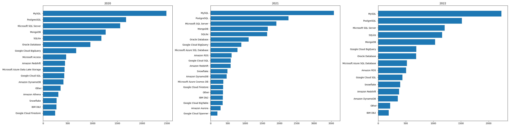
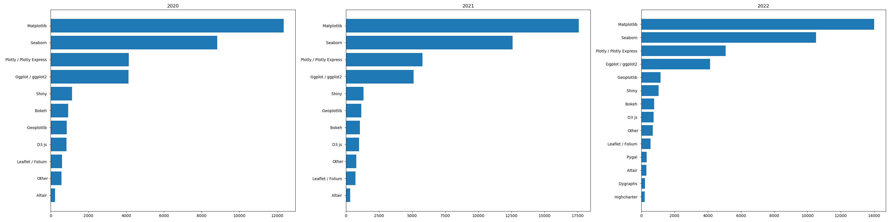

# Data Scientists Toolbox

## 簡介
Data Scientists Toolbox 透過 2020、2021 與 2022 年 [kaggle.com](https://www.kaggle.com) 舉辦的 Kaggle Machine Learning and Data Science Survey 問卷進行研究，對下列三個常見初學者問題進行分析。

1. 從事資料科學工作的職缺抬頭（title）有哪些？
2. 從事資料科學工作的日常內容是什麼？
3. 想要從事資料科學工作，需要具備哪些技能與知識？

我們使用了 `pandas` 與 `sqlite3` 建立了資料庫，再用 `matplotlib` 進行驗證並做出此專案。

## 如何重現
- 安裝[Miniconda](https://docs.anaconda.com/miniconda)
- 根據 `environment.yml` 建立環境:

```bash
conda env create-f environment.yml
```

- 將 `data/` 資料夾中`kaggle_survey_2022_responses.csv`,`kaggle_survey_2021_responses.csv`,`kaggle_survey_2020_responses.csv`放到`data/`
- 啟動環境並執行 `python create_kaggle_survey_db.py` 可以再 `data/` 建立 `kaggle_survey.db`
- 啟動環境並執行 `python create_longitudianl_analysis_plots.py` 就能輸出六張長條圖

### 從事資料科學工作的職缺抬頭（title）有哪些？

Data Scientist, Data analyst, Software engineer, ... etc


### 從事資料科學工作的日常內容是什麼？

Analyze and understand data to influence product or business decisions.


### 想要從事資料科學工作，需要具備哪些技能與知識？

Programming Languages: Python, SQL, R, C++


Database: MySQL, PostgreSQL, MS SQL Server,...etc.



Visualization: Matplotlib, Seaborn, Plotly, ...etc.



Machine_Learning Algorithm: Linear/Logistic regression, Decision Tree/Random Forrest, Deep Learning, XGBoost, ...etc.

